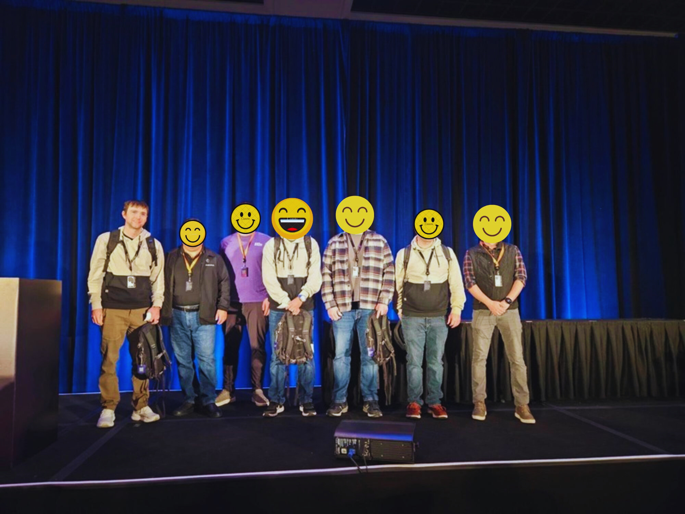

AWS Jam Sessions are hands-on, gamified events designed to test your knowledge of AWS services, security, architecture, and operational best practices. Competing in a Jam requires a mix of AWS expertise, problem-solving skills, quick thinking, and teamwork. If you want to maximize your chances of winning, here’s a strategic guide to your next AWS Jam Session.

---

### **What to expect**

<<<<<<< HEAD

=======

>>>>>>> develop

`AWS Jam Session teams must solve under time constraints.` Challenges range from security incident response and infrastructure automation to networking and AI/ML deployments.  `Teams are typically made up of four members.`

Teams earn points based on completed challenges, and a leaderboard tracks progress throughout the event. You can use hints if you’re stuck, but the hints will lower your points.  Expect a fun atmosphere for gamified learning where collaboration and problem-solving skills are key.

---

### **Bring a good team or build it**

`Jams are the most fun when you bring a four member team.`

If you don’t have a pre-formed team, don’t worry, network at re:Invent, find like-minded participants in line and form an ad-hoc team. Diversity in skills often wins over a team of specialists.

---

### **Divide and Conquer**

`The most important strategy with placing in an AWS Jam is to divide and conquer.`  You should coordinate with your team and each team member should take on one challenge at a time.

---

### **Use Support**

`Ask for help from the event staff if you run into technical issues.`  Its common to run into bugs or technical issues during a Jam, always ask for help if you believe it's a technical issue.

---

### **Use Hints**

The top scores are often determined by what team used the least amount of hints.  Its important to balance completing the challenges quickly with reserving hints for only when they are absolutely necessary.

`The best strategy is to time box your challenges` and do your best to avoid using hints, but if you run out of time, its better to use a hint and complete the challenge.

---
### **Have Fun!**

AWS Jams are a fun way to get hands-on learning experience at re:Invent.  Make friends and have fun learning.

---

<<<<<<< HEAD

=======

>>>>>>> develop
1st place win `AWS DevOps and Modernization` re:Invent 2024 Jam

- [AWS GameDay](https://aws.amazon.com/gameday)  
- [AWS Jam](https://aws.amazon.com/es/professional-services/jam/)  